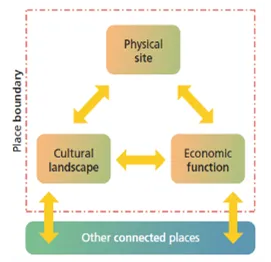

# Physical features

The site of a place is the acutal land it is built on. Settlements have historically taken root wherever geographical site factors favour economic activities that cannot be carried out as profitably elsewhere. Local resources such as coal or water explain why some places are where they are. Places within large cities have their own advantageous site factors and topography. The high elevation of London's Hampstead neighbourhood, for example, provided wealthy Victorians with clean air and safe water. It remains an affluent place.
