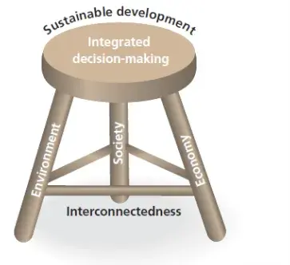

# Sustainability

September 2015 saw 193 world leaders agree to 17 global goals for sustainable development - the SDGS - the successors of the Millennium Development Goals (MDGs). Were these goals to be completed, it will mean an end to extreme poverty, inequality and climate change by 2030.

# Meaning of sustainability

A buzzword, often misused by politicians and business leaders. It's become a word used by people demonstrating they are being - or appearing to be - more environmentally friendly - &apos;green&apos;.

One study found that there are 500 different attempts in academic literature to define sustainable development. So, in one sense, it could be seen as an evolving and developing concept. Generally, it is about improving situations today in a way that does not damage the future or must be paid for tomorrow. The Brundtland Report (1987) was the first to coin the term sustainable development, providing this definition:

&ldquo;Sustainable development is the ability to meet the needs of the present without compromising the ability of future generations to meet their own needs&rdquo;.

Some, such as WWF, have developed this and stressed the environmental aspects:

&ldquo;Sustainable development is maintaining and enhancing the quality of human life while living within the carrying capacity of supporting ecosystems&ldquo;.

In 1999 the UK Department for the Environment Transport and the Regions (DETR) defined it as &ldquo;A better quality of life for everyone, now and for generations to come&rdquo;. Note, the emphasis here is on people, rather than the environment.

The British diplomat and environmentalist Sir Crispon Tickell defined the term succintly as &ldquo;Treating the Earth as if we intended to stay there&rdquo;, a statement which cleverly links the environmental and people themes together.

Three goals are said to compromise sustainable development: 

- _Economic sustainability_: individuals and communities should have access to a reliable income over time.

- _Social sustainability_: all individuals should enjoy a reasonable quality of life.

- _Environmental sustainability_: no lasting damage should be done to the environment; renewable resources must be managed in ways that guarantee continued use.

One way to visualise these ideas and how they can be managed, diagrammatically is the 3-legged stool of sustainability.

# Links to the concept of carrying capacity and ecological footprint

The WWF definition above links sustainability to carrying capacity. The *carrying capacity* of an area refers to the largest population that the resources of a given environment can support. The term also has its origins in ecology and is used widely in agriculture. The Reverend Thomas Malthus famously put forward the concept of a population ceiling where a saturation level is reached when the population equals the carrying capacity of that environment. 

Carrying capacity is also influenced by
development, the living standards of
people and in turn the consumption
patterns of a population. The latter is
also a function of attitudes. As a
society becomes more
&apos;westernised&apos;, then consumption
rates increase. This can be evidenced by
the increasing consumer consumption rates
of people in emerging countries such as
China and India have for goods produced
by Prada, Gucci and BMW. Some writers
have said that current patterns of
consumption in some parts of the world
are no longer sustainable. 

The term &apos;ecological footprint&apos; is also relevant here. An ecological footprint refers to a measurement of the area of land or mater required to provide a person (or society) with the energy, food and other resources they consume and render the waste they produce harmless. Using this assessment, it is possible to estimate how much of the Earth (or how many planet Earths) it would take to support humanity if everybody lived a given lifestyle (and consumption rate)
