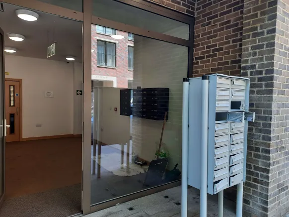

# Architecture

All keys were exactly the same, recall neighbour below accidentaly opening ours

Let us take two people.

Person A's route to work consists of lush gardens. The office brickwork is bright and vibrant, the windows purposefully designed for maximum light. The gargoyles even look pretty.

Person B's route to work is through a soviet-esque concrete jungle, there are no gardens, save for the weeds and lichens growing in the cracks of pavement. The only gargoyles are the gorilla-faced security guards that grunt at him.
