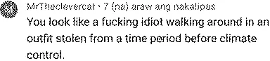
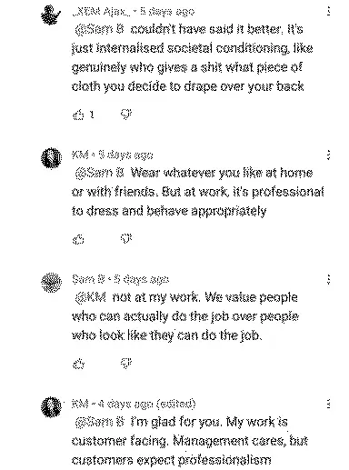

# Tailoring

<figcaption>One is bad. And one is good</figcaption>

# Inconspicuously Conspicuous

<!-- Insert funny kirby alisoin comments -->

# Low armholes

# Fusing

# Synthetics

<!-- insert st. paisios quote -->
# Proportions

# Lose weight

I will say this to men, you look like an egg cup if you wear high rise and a potato if you go low-rise.

# &ldquo;Fashion&rdquo;

Fast-fashion is stupid. Tailoring is timeless. Fashion is 

# Stupid things

- Don't combine braces (suspenders) with belts - this should be a given but it's always as painful as the first time seeing on someone.

# Practical solutions

# Basic formulae 

Utility + Satisfaction + Cost per wear

# &ldquo;Thrifting&rdquo;

In principle, this is good, removes a lot of old clothes from circulation. However, the goal is to scratch that itch of finding utility + satisfaction. Bygone era, when boxiness was all the rage. You can remove shoulder pads, 

My tailor is Whistles in Bethnal Green, Ken given his age, may not be around for much longer (he may retire), 

# Finding a tailor

A good tailor will confidently poke, prode and dicate in exactly the right way for his diagnosis. A bad tailor will most probably grunt at you and mutter under his breath.
<!-- Seem allowance -->
Tail
<!-- Insert gentlemans gazette post on fusing -->
